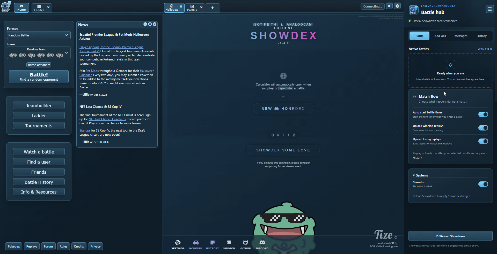

<p align="center">
  
</p>

<h1 align="center">Pokémon Showdown Pro</h1>

<p align="center">
  <strong>Your battles. Your tools. One desktop app.</strong><br>
  The official live Pokémon Showdown client, with Showdex, a custom Pro theme, and built-in battle tools.
</p>

<p align="center">
  <a href="https://github.com/Ryukotsuki/PokemonShowdownPro/releases"></a>
  <a href="https://github.com/Ryukotsuki/PokemonShowdownPro/releases"></a>
  <a href="https://github.com/Ryukotsuki/PokemonShowdownPro/stargazers"></a>
  <a href="https://github.com/Ryukotsuki/PokemonShowdownPro/issues"></a>
</p>

---

## Showcase



*A familiar Showdown experience with a matching blue theme and your battle tools close at hand.*

## Features

- **A polished Pro theme.** Matching blue surfaces, menus, tooltips, dialogs, and controls across Showdown, Showdex, and add-on windows. Light and Dark remain available.
- **Full Showdex integration.** Calcdex opens alongside battles, with the upstream calculator and its other tools built into the app.
- **A collapsible Battle Hub.** Keep active matches, add-ons, messages, records, and replay links together. Collapse the panel when you want more space.
- **Better battle review.** A redesigned Battle History dashboard with saved battles, win/loss badges, rating charts, filters, and Pokémon statistics.
- **PokéPaste tools.** Preview shared teams, import them locally, and export available open team sheets.
- **Both Showdown clients.** Opens the new official interface by default, with the classic client still available and your preferred theme and settings preserved.
- **Automatic add-on updates.** Daily checks run between battles. Compatible updates apply on restart, with rollback if loading fails.
- **App release updates.** Pro checks GitHub for new releases. Windows installations and Linux AppImages download updates with a restart button; portable archives and macOS offer the matching download.

## Linux desktop shortcut

Make the downloaded AppImage executable and run it once, or launch `AppRun` from an extracted AppImage. The first successful launch creates a desktop shortcut and an application-menu entry using your current installation path. The icon is stored in your user data directory so it remains available after the AppImage unmounts. Extracted `.tar.gz` releases also support this.

If your desktop asks you to **Allow Launching**, enable it for the new shortcut. Later launches preserve manually edited shortcuts and respect a deleted desktop icon at the same installation path. Moving or replacing the installation at a new path creates the shortcut again and refreshes older generated menu entries.

To restore a missing desktop icon without opening the app, run your release with `--install-shortcuts`:

```sh
./PokemonShowdownPro-1.0.0-linux-x86_64.AppImage --install-shortcuts
# Or, inside an extracted tar release:
./pokemon-showdown-pro --install-shortcuts
```

This also refreshes generated application-menu launchers and their persistent icon. Manually edited launchers are preserved. Desktop environments with desktop icons disabled still provide the application-menu entry.

## Built-in add-ons

All six add-ons are included and enabled initially. Use **Battle Hub → Add-ons** to choose which ones you want.

| Add-on | What it adds |
| --- | --- |
| **Enhanced Tooltips** | Type effectiveness, move details, and optional base stats. |
| **Randbats Tooltip** | Possible random battle sets and probabilities. |
| **Three Island** | PokéPaste previews, team importing, and item/Tera icons. |
| **Did it Tera?** | Compact reminders showing a Pokémon's Tera type, with customizable text. |
| **Battle History** | Local battle records, statistics, rating charts, favorites, and filters. |
| **PokePaste Exporter** | Team sheet viewing and exporting in battles with open team sheets. |

## Battle Hub

| Tab | What you'll find |
| --- | --- |
| **Battle** | Active matches, the Showdex switch, an optional automatic battle timer, and winning/losing replay upload settings. |
| **Add-ons** | Individual add-on switches, settings windows, Battle History, and update controls. |
| **Messages** | Optional greeting and closing messages that you write yourself. |
| **History** | Session and all-time win/loss/tie records, plus your 20 most recent confirmed replay uploads. |

Replay uploads and automatic messages are optional. Your login, teams, add-on settings, and Showdex preferences persist between launches.

## Getting started

### Already set up?

On Windows, double-click **Start Showdown Pro.cmd**, or run:

```powershell
npm start
```

Sign in using Showdown's normal interface. An internet connection is required; battles use the official live service.

### Set up from source

Install **Node.js 24 or later** and **Git**, then download or clone this repository and open PowerShell in its root folder.

The upstream source repositories are pinned in [vendor-versions.json](vendor-versions.json). If they are not included in your download, fetch them with:

```powershell
$upstream = Get-Content .\vendor-versions.json -Raw | ConvertFrom-Json
foreach ($name in @('showdex', 'pokemon-showdown-client')) {
    git clone $upstream.$name.remote "vendor/$name"
    git -C "vendor/$name" checkout $upstream.$name.commit
}
```

Then install the app dependencies, build Showdex, and download the add-ons:

```powershell
npm ci
npm run setup
npm run download:addons
npm start
```

The current launcher uses Node.js and npm. No local Showdown server is required.

### Choose your theme

Pro is the default for Showdown, Showdex, and the Battle Hub on Windows, macOS, and Linux. Existing theme selections are preserved.

- **Classic client:** Settings → Graphics → Theme → **Pro**
- **New client:** Settings → Appearance → Theme → **Pro**
- **Showdex:** Settings → Color Mode → **Pro**

Showdex's theme is independent of the main client. Add-on windows follow the app's theme.

## Updates

**Battle Hub → Add-ons → App updates** checks stable GitHub releases once a day between battles. Installed Windows builds and Linux AppImages download new versions automatically and verify their SHA-512 checksums. Choose **Restart to update** when your battles finish. Pro never installs an update just because you close it, and your profile and settings remain saved.

macOS builds are currently unsigned, so they offer **Download update** for the correct Intel or Apple Silicon release. Windows portable ZIP and extracted Linux builds also use a download-and-install fallback. Source checkouts do not update themselves. Existing releases without the updater need one manual upgrade to a build containing it.

**Add-on updates** separately checks the six browser add-ons and stable Showdex releases once a day while no battles are active.

New packages receive the Pro styling and compatibility patches, then run checks against both Showdown clients in isolated, muted profiles. Verified updates apply when you restart the app. Failed checks keep the installed versions; failed startup restores the previous version.

Use **Check now** for a manual check, or turn off **Automatic updates** to check only when you choose. Your settings are retained through updates.

## Development

Run these checks from the repository root:

```powershell
npm test
npm run audit:hub
npm run audit:addons
```

Electron tests and previews run with sound muted and use isolated test profiles.

## Credits and license

Built on the work of [Pokémon Showdown](https://github.com/smogon/pokemon-showdown-client), [Showdex](https://github.com/doshidak/showdex), [Electron](https://github.com/electron/electron), and the creators of the included add-ons.

Pokémon Showdown Pro is an independent community project. See [THIRD_PARTY_NOTICES.md](THIRD_PARTY_NOTICES.md) for upstream credits and licenses.

Licensed under [AGPL-3.0-or-later](LICENSE). Third-party code and assets retain their respective licenses and ownership.
